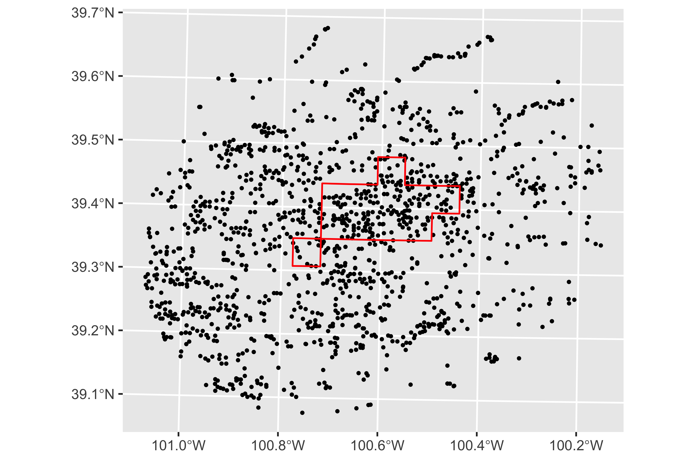

class: inverse, center, middle
name: mvr

```{r, child = './../setup.Rmd'}
```

```{r knitr-setup, include = FALSE, cache = F}
library(knitr)
opts_chunk$set(
  echo = F,
  root.dir = here("LectureNotes/13_ImpactEvaluation")
)
```
```{r echo = F, eval = F}
setwd(here("LectureNotes/13_ImpactEvaluation"))
```

```{r additional-libraries, include = F, cache = F}
#--- load packages ---#
library(broom)
library(fixest)
library(gt)
library(flextable)
library(readstata13)
library(lmtest)
library(modelsummary)
```

# Impact (Program) Evaluation

<html><div style='float:left'></div><hr color='#EB811B' size=1px width=1000px></html>

---
class: middle


.content-box-green[**Definition**]

Impact (program) evaluation is a field of econometrics that focuses on estimating the impact of a program or event.

<br>

.content-box-green[**Examples**]

+ Groundwater use limit in Nebraska $\Rightarrow$ water use 
+ Technology adoption (soil moisture sensor) $\Rightarrow$ water use 
+ Crop insurance $\Rightarrow$ input use 
+ Job training program $\Rightarrow$ productivty 
+ Food Stamp $\Rightarrow$ health, education, etc

---
class: middle

.content-box-red[**Key challenge**]

Most of the programs you are interested in are not randomized.

$\downarrow$ 

Selection Bias (endogeneity problem arising from self-selection into the program)

---
class: middle

.content-box-green[**Gold Standard**]

+ The best (if feasible) way to tackle the problem of selection bias in impact evaluation is randomized experiment, where who gets treated or not is determined randomly (you design a program or experiment and randomize treatment-control assignment)

+ This ensures that the treatment status (dummy variable indicating treated or not) is not correlated with the error term 

<br>

.content-box-green[**Example**]

$y \;\;(\mbox{income}) = \beta_0 + \beta_1 program \;\;(\mbox{financial aid}) + u$

, where $E[u|program]=0$ (the program is correlated with the error term). OLS is just fine.

--

<br>

.content-box-red[**Problem**]

Many of the programs are simply not possible to randomize because of financial and/or ethical reasons.

$\downarrow$

We need to use data from an event that happened outside our control.


---
class: middle

# Natural (Quasi) Experiment 

.content-box-green[**Definition**]

An event or policy change (often a change in government policy) that happens .blue[outside of the control of investigators], which changes the environment in which agents (individuals, families, firms, or cities) operate.

--

<br>

.content-box-green[**Challenges**]

The program is most likely correlated with the error term.

--

<br>

.content-box-green[**Lecture Objectives**]

+ Discuss different ways of estimating the impact of a program

+ Understand the strength and weakness of these methods  

---
class: middle

# Example program

.content-box-green[**Incinerator Construction**]

+ rumored about the incinerator being built in North Andover, Massachusetts, began in 1978

+ construction started in 1981

<br>

.content-box-green[**Data collected**]

Housing prices in 1978 and 1981, and other variables (we observations before and after the incinerator construction)

---
class: middle
 
# Various Approaches 

+ <span style = "color: blue;"> Approach 1 </span>: cross-sectional comparison of houses that are close to (treated) and far away from (control) to the incinerator .red[after] the incinerator was built (data in 1981)
  
+ <span style = "color: blue;"> Approach 2 </span>: comparison of the houses that are close to the incinerator before (control) and after (treated) the incinerator was built (data in 1978 and 1981)

+ <span style = "color: blue;"> Approach 3 </span>: comparison of differences (close by v.s. far away) in differences (before-after) of house prices (this method will become clearer later)

---
class: middle

# Approach 1

Run regression on the following model using the 1981 data (cross-sectional data)

$rpice = \gamma_0 + \gamma_1 nearinc + u$

+ $rprice$: house price in real terms (inflation-corrected)

+ $nearinc$: 1 if the house is near the incinerator, and 0 otherwise

+ $\gamma_1$: .blue[the difference between the mean house price of houses nearby the incinerator and the rest (not nearby) in 1981]

<br>

.content-box-green[**Question**]

Is `nearinc` endogenous?

---
class: middle

```{r }
#--- import the data ---#
data <-
  read.dta13("KIELMC.dta") %>%
  mutate(rprice = rprice / 1000)

#--- run regression ---#
reg_81 <-
  feols(
    rprice ~ nearinc,
    data = filter(data, year == 1981)
  )
```

```{r echo = F}
msummary(
  reg_81,
  gof_omit = "IC|Log|Adj|F|Pseudo|Within",
  output = "flextable",
  star = TRUE
) %>%
  fontsize(size = 12, part = "all") %>%
  color(i = 3, j = 2, color = "red") %>%
  padding(
    padding.top = 5,
    padding.bottom = 5,
    part = "all"
  ) %>%
  autofit()
```

<br>

.content-box-green[**Question**]
Is this reliable? 

---
class: middle

# Take a look at 1978 

Run regression on the following model using the .red[1978] data (cross-sectional data)

$rpice = \gamma_0 + \gamma_1 nearinc + u$

$\gamma_1$ represents the difference between the mean house price of houses nearby the incinerator and the rest (not nearby) .red[before] the incinerator was built.

---
class: middle

```{r 78_reg}
#--- run regression ---#
reg_78 <-
  feols(
    rprice ~ nearinc,
    data = filter(data, year == 1978)
  )
```

```{r echo = F}
msummary(
  reg_78,
  gof_omit = "IC|Log|Adj|F|Pseudo|Within",
  output = "flextable",
  star = TRUE
) %>%
  fontsize(size = 12, part = "all") %>%
  padding(
    padding.top = 5,
    padding.bottom = 5,
    part = "all"
  ) %>%
  color(i = 3, j = 2, color = "red") %>%
  autofit()
```

<br>

.content-box-red[**Critical**]

Houses nearby the incinerator were already lower than those houses that are not nearby...

---
class: middle

```{r echo = F, out.width = "70%"}
data_mean <- data %>%
  group_by(year, nearinc) %>%
  summarize(m_rprice = mean(rprice))

ggplot() +
  geom_bar(
    data = data_mean,
    aes(
      y = m_rprice,
      x = factor(year),
      fill = factor(nearinc)
    ),
    stat = "identity",
    position = "dodge"
  ) +
  ylab("Mean House Price ($1000$)") +
  xlab("Year") +
  scale_fill_discrete(name = "") +
  theme(legend.position = "bottom") +
  theme_bw()
```

---
class: middle

```{r echo = F}
ex_results_tab <- data.frame(
  `treated` = c("nearinc = 0", "nearinc = 1"),
  `before` = c("\\(\\gamma_0\\)", "\\(\\gamma_1\\)"),
  after = c("\\(\\gamma_0 + \\alpha_0 + 0\\)", "\\(\\gamma_1 + \\alpha_1 + \\beta \\)")
) %>%
  knitr::kable(
    format = "html",
    escape = FALSE
  )

ex_results_tab
```

<br>

+ $\gamma_j$ is the average house price of those that are $nearinc=j$ in 1978 (before)

+ $\alpha_j$ is .blue[any] macro shocks .blue[other than the incinerator event] that happened between the before and after period to the houses that are $nearinc=j$

+ $\beta$ is the true causal impact of the incinerator placement

---
class: middle

```{r echo = F}
ex_results_tab
```

+ $\gamma_j$ is the average house price of those that are $nearinc=j$ in 1978 (before)

+ $\alpha_j$ is .blue[any] macro shocks .blue[other than the incinerator event] that happened between the before and after period to the houses that are $nearinc=j$

+ $\beta$ is the true causal impact of the incinerator placement

<br>

.content-box-green[**Question**]

So, what did we estimate with Approach 1?

--

<br>

.content-box-green[**Answer**]

$E[rprice|nearinc = 1, year = 1981] - E[rprice|nearinc = 0, year = 1981]$

$= (\gamma_1 + \alpha_1 + \beta) - (\gamma_0 + \alpha_0 + 0)$

$= (\gamma_1 - \gamma_0)+ (\alpha_1 - \alpha_0) + \beta$

--

+ $\gamma_1 - \gamma_0$: pre-existing differences in house price .red[before] the incinerator was built

+ $\alpha_1 - \alpha_0$: differences in the trends in housing price between the two groups  

---
class: middle


+ $\gamma_1 - \gamma_0$: pre-existing differences in house price .red[before] the incinerator was built

+ $\alpha_1 - \alpha_0$: differences in the trends in housing price between the two groups  

<br>

.content-box-green[**Question**]

So, when Approach 1 gives us unbiased estimation of the impact of the incinerator? 

<br>

.content-box-green[**Answer**]

+ $\gamma_1 = \gamma_0$: the average house price between the two groups are the same before the incinerator was built

+ $\alpha_1 - \alpha_0$: the two groups experienced the same house price trend from 1978 to 1981

---
class: middle

# Approach 2 


Compare of the houses that are close to the incinerator before (control) and after (treated) the incinerator was built (data in 1978 and 1981)

<br>

.content-box-green[**Data**]

Restrict the data to the houses that are near the incinerator 

<br>

.content-box-green[**Model**]

$rpice = \beta_0 + \beta_1 y81 + u$

+ $rprice$: house price in real terms (inflation-corrected)

+ $y81$: 1 if the house is near the incinerator, and 0 otherwise

+ $\beta_1$: .blue[the difference in the mean house price of houses nearby the incinerator before and after the incinerator was built]


---
class: middle

```{r reg_ba}
reg_treated <- feols(
  rprice ~ y81,
  data = filter(data, nearinc == 1) # <<
)
```

```{r echo = F}
msummary(
  reg_treated,
  gof_omit = "IC|Log|Adj|F|Within|Pseudo",
  output = "flextable",
  star = TRUE
) %>%
  fontsize(size = 12, part = "all") %>%
  color(i = 3, j = 2, color = "red") %>%
  padding(
    padding.top = 5,
    padding.bottom = 5,
    part = "all"
  ) %>%
  autofit()
```

<br>

The incinerator increased the average house price (not statistically significant).

---
class: middle

```{r echo = F}
ex_results_tab
```

<br>

+ $\gamma_j$ is the average house price of those that are $nearinc=j$ in 1978 (before)

+ $\alpha_j$ is .blue[any] macro shocks .blue[other than the incinerator event] that happened between the before and after period to the houses that are $nearinc=j$

+ $\beta$ is the true causal impact of the incinerator placement

<br>

.content-box-green[**Question**]

So, what did we estimate with Approach 2?

--

<br>

.content-box-green[**Answer**]

$E[rprice|nearinc = 1, year = 1981] - E[rprice|nearinc = 1, year = 1978]$

$= (\gamma_1 + \alpha_1 + \beta) - \gamma_1$

$= \alpha_1 + \beta$

---
class: middle

$E[rprice|nearinc = 1, year = 1981] - E[rprice|nearinc = 1, year = 1978]$

$= (\gamma_1 + \alpha_1 + \beta) - \gamma_1$

$= \alpha_1 + \beta$

--

<br>

.content-box-green[**Question**]

So, when Approach 2 gives us unbiased estimation of the impact of the incinerator? 

--

<br>

.content-box-green[**Answer**]

$\alpha_1 = 0$: no trend in house price for the houses near the incinerator 

Nothing else significant other than the incinerator happened 
between 1978 and 1981. 

---
class: middle

# Approach 3

Compare of differences (close by v.s. far away) in differences (before-after) of house prices (this method will become clearer later)

+ Find the difference in the price of the houses .red[close to] the incinerator before and after the incinerator was built 

+ Find the difference in house price (close to the incinerator) before and after the incinerator was built  

+ Find the difference in the differences

<br>

.content-box-green[**Note**]

This method is called DID estimation method (Difference-in- differences). 

---
class: middle

<br>

.content-box-green[**Data**]

All the observations 

<br>

.content-box-green[**Model**]

$rpice = \beta_0 + \beta_1 y81 + \beta_2 nearinc + \beta_3 nearinc \times y81 + u$

+ $\beta_3$: the difference in differences

--

Let's confirm $\beta_3$ indeed represents the difference in the differences.

---
class: middle

.content-box-green[**Model**]

$rpice = \beta_0 + \beta_1 y81 + \beta_2 nearinc + \beta_3 nearinc \times y81 + u$

--

<br>

.content-box-green[**Expected house price**]

+ $E[rprice|year=1981, nearinc = 0] = \beta_0 + \beta_1$ 

+ $E[rprice|year=1981, nearinc = 1] = \beta_0 + \beta_1 + \beta_2 + \beta_3$

+ $E[rprice|year=1978, nearinc = 0] = \beta_0$

+ $E[rprice|year=1978, nearinc = 1] = \beta_0 + \beta_2$

--

<br>

.content-box-green[**Differences**]

$E[rprice|year=1981, nearinc = 1] - E[rprice|year=1978, nearinc = 1]$

$= (\beta_0 + \beta_1 + \beta_2 + \beta_3) - (\beta_0 + \beta_2)$
$= \beta_1 + \beta_3$

$E[rprice|year=1981, nearinc = 1] - E[rprice|year=1978, nearinc = 0]$

$= (\beta_0 + \beta_1) - \beta_0$
$= \beta_1$

--

<br>

.content-box-green[**Difference in the differences**]

$(\beta_1 + \beta_3) - \beta_1 = \beta_3$

---
class: middle

```{r reg_ba_did}
reg_did <- feols(
  rprice ~ nearinc + y81 + nearinc * y81,
  data = data
)
```

```{r echo = F}
msummary(
  reg_did,
  gof_omit = "IC|Log|Adj|F|Within|Pseudo",
  output = "flextable",
  star = TRUE
) %>%
  fontsize(size = 12, part = "all") %>%
  color(i = 7, j = 2, color = "red") %>%
  padding(
    padding.top = 5,
    padding.bottom = 5,
    part = "all"
  ) %>%
  autofit()
```

<br>

The incinerator decreased the average house price (not statistically significant).  

---
class: middle

```{r echo = F}
ex_results_tab
```

<br>

.content-box-green[**Question**]

So, what did we estimate with Approach 3?

--

<br>

.content-box-green[**Answer**]

$E[rprice|nearinc = 1, year = 1981] - E[rprice|nearinc = 1, year = 1978]$

$= (\gamma_1 + \alpha_1 + \beta) - \gamma_1 = \alpha_1 + \beta$

$E[rprice|nearinc = 0, year = 1981] - E[rprice|nearinc = 0, year = 1978]$

$= (\gamma_0 + \alpha_0) - \gamma_0 = \alpha_0$

--

Differences $= \alpha_1 - \alpha_0 + \beta$

---
class: middle

.content-box-green[**Difference**]

Difference $= \alpha_1 - \alpha_0 + \beta$

<br>

.content-box-green[**Question**]

So, when Approach 3 gives us unbiased estimation of the impact of the incinerator? 

--

<br>

.content-box-green[**Answer**]

+ $\alpha_1 = \alpha_0$: the two groups experienced the same trend in house price from 1978 to 1981

+ Unlike Approach 1, the pre-existing difference between the two group is not a problem as it is canceled out 

---
class: middle

.content-box-green[**Key condition (common/parallel trend assumption)**]

$\alpha_1 = \alpha_0$: the two groups experienced the same trend in house price from 1978 to 1981

<br>
.content-box-green[**Common/parallel trend assumption in general**]  

If no treatment had occurred, the difference between the treated group and the untreated group would have stayed the same in the post-treatment period as it was in the pre-treatment period. 

<br>

.content-box-red[**Important**]

This condition/assumption is <span style = "color: red;"> NOT </span> testable because you never observe what would the treament group be like if it were not for the treatment (we will discuss this further)

---
class: middle

.content-box-green[**Approaches**]
    
Approach 1: $(\gamma_1 - \gamma_0)+ (\alpha_1 - \alpha_0) + \beta$

Approach 2: $\alpha_1 + \beta$

Approach 3: $\alpha_1 - \alpha_0 + \beta$

--

<br>

.content-box-red[**Important**]

--

+ None of these approaches are perfect. 

--

+ It is hard to sell Approaches 1 and 2

--

+ Approach 3 (DID) is preferred over Approaches 1 and 2  

--

+ But, Approach 3 is not certainly perfect and could definitely have a larger bias than Approaches 1 and 2

e.g., $\alpha_1 = 5$ and $\alpha_0 = - 5$

---
class: middle

# DID: Another Example

.content-box-green[**Cholera**]

+ Back in mid 1800s', Cholera was believed to spread via air
+ John Snow believe it was actually through fecally-contaminated water

<br>

.content-box-green[**Setting**]

+ London's water needs were served by a number of competing companies, who got their water intake from different parts of the Thames river. 

+ Water taken in from the parts of the Thames that were downstream of London contained everything that Londoners dumped in the river, including plenty of fecal matter from people infected with cholera. 

<br>

.content-box-green[**Natural Experiment**]

+ Between those two periods of 1849 and 1854, a policy was enacted: the Lambeth Company was required by an Act of Parliament to move their water intake upstream of London. 

---
class: middle

.content-box-green[**Treatment**]

+ Switch of where water is taken (downstream to upstream)

<br>

.content-box-green[**Before and After**]

+ "before" (1849): Lambeth took water downstream
+ "after" (1854): Lambeth took water upstream

<br>

.content-box-green[**Control and Treatment Groups**]

+ Control group: those who were not served by Lambeth 
+ Treatment group: those who were served by Lambeth 


---
class: middle

.content-box-green[**Data**] 

```{r echo = F}
data.table(
  Supplier = c("Non-Lambeth only", "Lambeth + Others"),
  `1849` = c(134.9, 146.6),
  `1854` = c(130.1, 84.9)
) %>%
  flextable() %>%
  autofit()
```

.content-box-green[**DID estimate**]

Estimate treatment effect is:

(84.9 - 130.1) - (146.6 - 134.9) = `r (84.9 - 130.1) - (146.6 - 134.9)`

---
class: middle

# DID using R 

.content-box-green[**Well-levle groundwater use data in Kansas**]

```{r echo = TRUE}
(
  lema_data <- readRDS("LEMA_data.rds")
)
```

<br>

.content-box-green[**Main variables**]

+ `site`: well
+ `af_used`: groundwater used (dependent variable)
+ `in_LEMA`: whether located inside the LEMA region or not
+ `year`: year

---
class: middle

.content-box-green[**Control and Treatment Units**]

+ (to be) treated: wells inside the red boundary (LEMA)
+ control: wells outside the red boundary (LEMA)

```{r well-LEMA}
#* This picture was created in a different project folder

```

---
class: middle

.content-box-green[**Before and After**] 

Effective 2013, wells located inside the LEMA can pump groundwater up to a certian amount

+ before: ~ 2012
+ after: 2013 ~ 

---
class: middle

Data transformation:

.content-box-green[**before or after**]
```{r echo = TRUE}
lema_data <- mutate(lema_data, before_after = ifelse(year >= 2013, 1, 0))

filter(lema_data, site == 160, year > 2000)
```

.content-box-green[**(to be) treated or not**]

Whether wells are (to be) treated or not is already there in this dataset, represented by `in_LEMA`

---
class: middle

.content-box-green[**DID estimating equation (in general)**]

$$
\begin{aligned}
y_{i,t} = \alpha_0 + \beta_1 before\_after_t + \beta_2 treated\_or\_not_i + \beta_3 before\_after_t \times treated\_or\_not_i + X_{i,t}\gamma + v_{i,t}
\end{aligned}
$$

The variable of interest is $\beta_3$, which measures the impact of the treatment.

---
class: middle

.content-box-green[**R code**] 

```{r }
did_res <- feols(af_used ~ before_after + in_LEMA + before_after * in_LEMA, data = lema_data)
```

---
class: middle

.content-box-green[**Important**]

Selecting the right control group is important in DID. If the following conditions are satisfied, it is more plausible that the control and treatment groups would have had the same macro shock $(\alpha_1 = \alpha_0)$ if it were not for the treatment.

+ There were no events that could significantly affect the dependent variable of the control group between the "before" and "after" period
+ The two groups are generally similar so other factors do not drive the differences between them
+ They had similar trajectories of the dependent variable prior to the treatment (possible if you have more than one years of data prior to the treatment)

---
class: middle

```{r echo = F, out.width = "80%", cache = FALSE}
set.seed(1000)
tb <- tibble(
  Time = rep(1:10, 2),
  Group = c(
    rep("Treatment", 10),
    rep("Control", 10)
  )
) %>%
  mutate(After = Time >= 7) %>%
  mutate(
    YCons = .4 * Time + 2 * After * (Group == "Treatment") + (Group == "Treatment") + rnorm(20, 0, .5),
    YDiv = (.3 + .5 * (Group == "Control")) * Time + 2 * After * (Group == "Treatment") + 3 * (Group == "Treatment") + rnorm(20, 0, .5)
  )

p1 <- ggplot(tb, aes(x = Time, y = YCons, color = Group)) +
  geom_point() +
  geom_line() +
  geom_vline(aes(xintercept = 7), linetype = "dashed") +
  geom_text(
    data = tb %>% filter(Time == 10),
    aes(x = Time + .1, label = Group, color = Group),
    size = 2, hjust = 0
  ) +
  annotate(
    geom = "label",
    x = 7,
    y = 1,
    label = "Treatment\nPeriod",
    size = 2
  ) +
  scale_color_manual(values = c("#676767", "black")) +
  expand_limits(x = 14) +
  labs(
    y = "Outcome",
    title = "(a) Parallel Prior Trends"
  ) +
  theme_pubr() +
  guides(color = "none") +
  theme(
    text = element_text(size = 6),
    axis.title.x = element_text(size = 6),
    axis.title.y = element_text(size = 6),
    axis.ticks = element_blank(),
    axis.text = element_blank()
  )

p2 <- ggplot(tb, aes(x = Time, y = YDiv, color = Group)) +
  geom_point() +
  geom_line() +
  geom_vline(aes(xintercept = 7), linetype = "dashed") +
  geom_text(
    data = tb %>% filter(Time == 10),
    aes(x = Time + .1, label = Group, color = Group),
    size = 2, hjust = 0
  ) +
  annotate(
    geom = "label",
    x = 7,
    y = 2.5,
    label = "Treatment\nPeriod",
    size = 2
  ) +
  scale_color_manual(values = c("#676767", "black")) +
  expand_limits(x = 14) +
  labs(
    y = "Outcome",
    title = "(b) Converging Prior Trends"
  ) +
  theme_pubr() +
  guides(color = "none") +
  theme(
    text = element_text(size = 6),
    axis.title.x = element_text(size = 6),
    axis.title.y = element_text(size = 6),
    axis.ticks = element_blank(),
    axis.text = element_blank()
  )


# ggsave(
#   'prior_trends.pdf', p1 | p2, width = 10, height = 5, units = 'in', device = cairo_pdf)
```

```{r cache = FALSE, out.width="80%", echo = F}
p1
```

---
class: middle

```{r cache = FALSE, out.width="80%", echo = F}
p2
```

