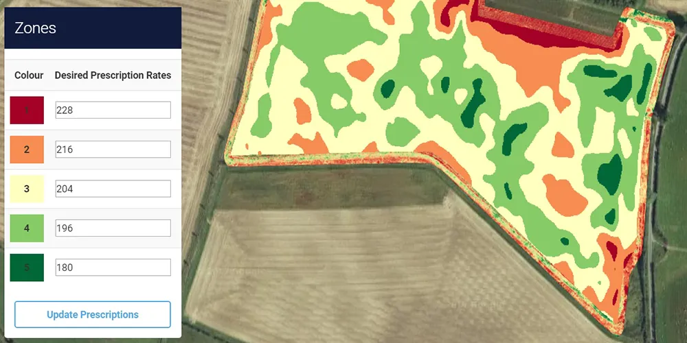

class: middle

```{r, child = "./../setup.Rmd"}
```


```{r prep, include = FALSE}
library(data.table)
library(magick)
library(officer)
library(flextable)
library(dplyr)
library(ggplot2)
opts_chunk$set(
  echo = F,
  root.dir = here()
)
```

# Outline

1. [Ligistics](#logistics)
2. [What is econometrics about?](#econometrics)
3. [Causality and Association](#causality)
4. [Endogeneity](#endogeneity)

---

class: inverse, center, middle
name: logistics

# Logistics

<html><div style='float:left'></div><hr color='#EB811B' size=1px width=1000px></html>

---
class: middle

# Instructors

+ <span style = "color: red;"> Instructor </span>: Taro Mieno (Office: 209, E-mail: tmieno2@unl.edu)
+ <span style = "color: red;"> Teaching Assistant </span>: Shunkei Kakimoto (E-mail: skakimoto3@huskers.unl.edu)

---
class: middle

# Goals of the course
+ Learn modern introductory econometric theory
+ Apply econometric theories to real economic problems
+ Learn how to use statistical software (R) so you can conduct research independently (without technical help from your advisor)
  - manage data
  - visualize data
  - run regressions
  - interpret results

---
class: middle

# Text Books

## Required:
Wooldridge, Jeffrey M. 2006. "Introductory Econometrics: A Modern Approach (<span style = "color: red;">5</span>th edition)." Mason, OH: Thomson/South-Western.

## Recommended
+ Florian, Heiss. 2016 "Using R for Introductory Econometrics." CreateSpace Independent Publishing Platform. (free version available online [here](http://www.urfie.net/))

---
class: middle

# Course Schedule

+ Lectures (MW): 3:00-4:30pm
+ Lab sessions (F): 1:00-2:30pm

---
class: middle

# Course Website

[Course Website](https://github.com/tmieno2/MS-Applied-Econometrics)
+ Lecture Slides 
+ Assignments
+ Final paper

---
class: middle

# Grading

+ Problem sets (4 assignments): 50% 
+ Paper: 50%
  - Proposal: 5%
  - Final paper: 45%

---
class: middle

# Assignments
  
## Problem sets
+ Most questions are from the required text book
+ Some questions come from what we cover in lab sessions

## Rmarkdown to do and submit your problem sets
+ You are required to present your R codes
+ You learn how to compile your assignment with your R code written in a document using <span style = "color: red;"> Rmarkdown </span>, which will be covered in the second lab session


---
class: middle

# Assignments

.content-box-red[**Caution**]  
+ 2nd year students have answers to all the questions I will assign (I will use exactly the same problems because they are really good to learn econometrics)
+ You are free to copy and paste (or rephrase) the answers for your assignment. I won't bother to try to tell if you have copied and pasted answers.
+ However, you are simply doing dis-service to yourself by depriving yourself of learning opportunities
+ Moreover, your lack of understanding of the material will be clearly manifested on your final paper (I am not at all shy of giving bad grades on the final paper)

---
class: middle

# Paper

In this assignment,
  + you write 
    - a paper proposal with in-class presentation (5 points)
    - a paper with a particular emphasis on econometric analysis using a real world data set (45 points)
  + you are encouraged to use the data set you are using for your masters thesis (talk with your advisor)
  + you need to ensure that you use a <span style = "color: red;"> panel </span> dataset
  + No presentation of your final paper

---
class: middle

# Paper
Here is the time line of the paper assignment:
  + <span style = "color: red;"> March, 23 </span>: identify a research topic and the data set you will be using, and get an approval from the instructor
  + <span style = "color: red;"> April, 1 </span>: paper proposal 
  + <span style = "color: red;"> May, 11 </span>: final paper 

---
class: middle

# Paper Proposal

## Introduction
+ clear identification of what you are trying to find out (research question) 
+ why the research question is worthwhile answering 

## Simple Model
+ dependent variable (the variable to be explained)
+ explanatory variable (variables to be explain)

## Data Source
+ where you get data

---
class: middle

# Final Paper

## Introduction
  + clear identification of what you are trying to find out (research question) [1 point]
  + why the research question is worthwhile answering [1 point]

## Data description
  + the nature of the data with summary statistics table [1 point]
  + visualize a few key variables in a meaningful way [3 points]

---
class: middle

# Final Paper

## Econometric Methods:
the <span style = "color: red;"> process </span> of how you end up with the final econometric models and methods. [40 points (<span style = "color: red;"> or more </span>)]
+ justification of your choice of independent variables
+ potential endogeneity problems
+ what did you do to address the endogeneity problems?
+ justification of econometric model(s) and method(s)
+ identify appropriate standard error estimation methods

## Results, Discussions, and Conclusions:
+ interpret and describe the results [2 points]
+ implications of the results [1 point]
+ conclusions [1 point]

---
class: inverse, center, middle
name: econometrics

# What is econometrics about?

<html><div style='float:left'></div><hr color='#EB811B' size=1px width=1000px></html>

---
class: middle

# What econometrics is about

.content-box-red[**Econometrics**]:

Estimate quantitative relationships between variables


.content-box-red[**Examples**]:

+ the impact of fertilizer on crop yield
+ the impact of political campaign expenditure on voting outcomes
+ the impact of education on wage

---
class: middle

# Steps in Econometric Analysis

+ formulation of the question of interest (what are you trying to find out?)
+ develop an economic model of the phenomenon you are interested in understanding (identify variables that matter)
+ turn the economic model into an econometric model
+ collect data
+ <span style = "color: blue;"> estimate the model using econometrics </span>
+ <span style = "color: blue;"> test hypotheses </span>


---
class: middle


# Step 2: Develop an economic model

.content-box-red[**Example: Job training and worker productivity**]

$$wage = f(educ,exper,training)$$

+ $wage$: hourly wage
+ $educ$: years of formal education
+ $exper$: years of workforce experience
+ $training$: weeks spent in job training

.content-box-green[**Note**]: Depending on questions you would like to answer, the economic model can (and should) be much more involved

---
class: middle

# Step 3: Develop an econometric model

$$wage = f(educ,exper,training)$$

The form of the function $f(\cdot)$ must be specified (almost always) before we can undertake an econometric analysis

$$wage = \beta_0 + \beta_1 educ + \beta_2 exper + \beta_3 training + u$$

## $\beta_0,\beta_1,\beta_2,\beta_3$
+ are the <span style = "color: red;"> parameters </span> of the econometric model.
+ describe the directions and strengths of the relationship between $wage$ and the factors used to determine $wage$ in the model

## $u$
+ is called error term
+ includes <span style = "color: red;"> ALL </span> the other factors that can affect wage other than the included variables (like innate ability)

---
class: middle

# Step 4: Collect data
+ survey
+ websites
+ experiment

---
class: middle

# Data types

.content-box-green[**Cross-sectional Data**]

+ a sample of individuals, households, firms, cities, states, countries, or a variety of other units, taken at a given point in time
+ the data on all units do not correspond to precisely the same time period
  - some families surveyed during different weeks within a year

---
class: middle

# Cross-sectional Data

```{r }
here("Data/wage1.rds") %>%
  readRDS() %>%
  data.table() %>%
  .[, .(wage, educ, exper, female, married)]
```

---
class: middle

# Data types: Time-series Data

.content-box-green[**Time-series Data**]
Observations on a variable or several variables over time
  + corn price
  + oil price

.content-box-red[**Note**]:
  + The econometric frameworks necessary to analyze time series data are quite different from those for cross-sectional data
  + We do <span style = "color: red;"> NOT </span> learn time-series econometric methods


---
class: middle

# Data types: Panel (Longitudinal) Data

.content-box-red[**Panel (Longitudinal) Data**]
time series data for each cross-sectional member in the data set (<span style = "color: red;"> same </span> cross-sectional units are tracked over a given period of time)

.content-box-green[**Example**]
  + wage data for individuals collected every five years over the past 30 years
  + yearly GDP data for 60 countries over the past 10 years

.content-box-red[**Notes**]
  + Panel data are much more common than they used to be
  + Panel data econometric methods take advantage of the panel data structure

---
class: middle

# Data types: Panel (Longitudinal) Data

```{r }
here("Data/crime4.rds") %>%
  readRDS() %>%
  .[, .(county, year, crmrte, prbarr, prbpris)]
```

---
class: middle

# Steps 5 and 6
This is what you learn for the next few months!!
  + estimate the model using econometrics
  + test hypothesis

---
class: inverse, center, middle
name: causality

# Causality and Association

<html><div style='float:left'></div><hr color='#EB811B' size=1px width=796px></html>

---
class: middle

# Causality and Association

.content-box-red[**Association**]

An association of two variables arise because <span style = "color: red;"> either of or both </span> variables affect the other variable

\begin{align}
  A \longleftrightarrow B 
\end{align}

Association does not concern which affects which. This is what <span style = "color: blue;"> correlation coefficient </span> measures.

.content-box-red[**Causality**]
Causal effect is the impact of one variable on the other,

\begin{align}
  A \rightarrow B 
\end{align}

Here, changes in $A$ cause changes in $B$, not the other way around

---
class: middle

Let's watch this [interesting CM](https://www.youtube.com/watch?v=KSHMgoUWBmY).

---
class: middle

.content-box-green[**Claims made in the video**]

People who wear glasses are

+ much smarter than those who don't
+ more likely to pursue higher education
+ 200% more likely to graduate college

--

For you to be convinced to buy glasses, these claims needs to be causal, not association:
+ Does wearing glasses make you much smarter?
+ Does wearing glasses make it more likely for you to pursue higher education?
+ Does wearing glasses make it 200% more likely for you to graduate college?

---
class: middle

However, this seems to be a more likely explanation of the association:

+ One spends more time studying academic subjects
  - smarter (or knowledgeable) $\rightarrow$ pursue higher education and graduate college 
  - worsened eyesight $\Rightarrow$ wear glasses

---
class: middle

.content-box-green[**Important**]:
+ We care about isolating causal effects, but not association
+ Identifying association is super easy
+ Identifying causal effects is extremely hard (this is what we tackle) 

---
class: inverse, center, middle
name: endogeneity

# Endogeneity: Your Nemesis

<html><div style='float:left'></div><hr color='#EB811B' size=1px width=796px></html>

---
class: middle

# Causality and Association

It is super easy to find an association of multiple variables, but it is incredibly hard to find a causal effect (at least in Economics)!!

---
class: middle

# Endogeneity

You are interested in the causal impact of fire fighters on the number of death tolls in fire events

```{r echo = F, out.width = "80%"}
data.table(
  `fire event` = 1:5,
  `death toll` = c(10, 0, 5, 3, 50),
  `# of firefighters deployed` = c(20, 3, 10, 5, 50)
) %>%
  flextable() %>%
  autofit() %>%
  width(2.2, j = 3) %>%
  align(j = 1:3, align = "center")
```

--

.content-box-green[**Questions**]
+ How are they associated?
+ Can you say anything about the causal effect of fire fighters deployment on the number of death tolls?

---
class: middle

# What happened?

You ignored an important variable!!

```{r echo = F}
data.table(
  `fire event` = 1:5,
  `death toll` = c(10, 0, 5, 3, 50),
  `# of firefighters deployed` = c(20, 3, 10, 5, 50),
  `scale of fire` = c(20, 5, 20, 10, 100)
) %>%
  flextable() %>%
  autofit() %>%
  width(2.2, j = 3) %>%
  align(j = 1:4, align = "center")
```

---
class: middle

# Endogeneity Problem

.content-box-green[**Endogeneity (Definition)**]:

Variables of interest are correlated with some unobservables (variables that cannot be observed or are missing) that have non-zero impacts on the variable that you want to explain

---
class: middle

In the above example,

+ <span style = "color: red;"> variable of interest </span>: the number of firefighters
+ <span style = "color: red;"> unobservables </span>: the scale of fire events (and other factors)
+ <span style = "color: red;"> variable to explain </span>: death toll

--

.content-box-green[**The model**]:
\begin{align}
  \mbox{death toll} = \alpha + \beta\; \mbox{# of fire fighters} + (\gamma\; \mbox{scale} + v)
\end{align}

.content-box-green[**Endogeneity Problem**]:

\# of fire fighters is correlated with scale, which we ignored

---
class: middle

.content-box-green[**Another example: education on wage**]
$$wage = \beta_0 + \beta_1 educ + \beta_2 exper + \beta_3 training + u$$
    
What are unobservables in $u$ that are likely to be correlated with $educ$?

.content-box-red[**An important unobservable**]      
+ innate ability $\rightarrow$ wage
+ innate ability $\rightarrow$ education

---
class: middle

Most of the time, you will be faced with endogeneity problems caused by at least one of the followings,

+ omitted variables (the scale of fire events, innate ability)
+ self-selection
+ simultaneity
+ measurement error

--

.content-box-red[**Central Question**]

How can we avoid or solve endogeneity problems?

---
class: middle

# How to deal with endogeneity?
+ You have two opportunities to deal with endogeneity problems
  - at the design stage
  - at the regression stage (what you will learn in this course)
+ Econometrics has evolved to address endogeneity problems at the regression stage because randomized experiments are infeasible most of the time
+ How about econometrics and other fields of statistics: Statistics, Psychometrics, and Biometrics?

---
class: middle

# How to deal with endogeneity?
```{r echo = FALSE, out.width="100%"}
data.table(
  Field = c("Econometrics", "Many other fields"),
  Design = c("not feasible (often)", "feasible"),
  `Estimation Method` = c("intricate", "relatively simple")
) %>%
  flextable() %>%
  autofit()
```

---
class: middle

# Deal with endogneity at the design stage

.content-box-red[**Randomized Experiments**]
+ you have a liberty to determine the level of the variable of interest
+ by randomizing the value of the variable of interest, you can effectively break the link (association) with whatever is included in the error term

---
class: middle

# The impact of fertilizer on corn yield (Non-Randomized)

.content-box-red[**Data**]:

Yield and nitrogen rate data obtained from a field that is managed by a farmer

```{r  echo = F, out.width = "70%"}

```

---
class: middle

# The impact of fertilizer on corn yield (Non-Randomized)

.content-box-green[**Farmer**]

+ decide nitrogen rate based on soil characteristics

.content-box-green[**Researcher**]

+ soil characteristics is not observable, so it is in the error term

$$yield = \beta_0 + \beta_1 N + (\gamma SC + \mu)$$

+ N (nitrogen rate) and SC (soil characteristics) are correlated

---
class: middle

# The impact of fertilizer on corn yield (Non-Randomized)

Suppose the farmer applied more nitrogen to the area where its soil characteristics lead to higher corn yield

.content-box-green[**Question**]
If the researcher estimate the model (which ignores soil characteristics), do you over- or under-estimate the impact of nitrogen rate on corn yield?

---
class: middle

# Randomized Experiments

```{r  echo = F, out.width = "70%"}
magick::image_read_pdf("field_map_N_IL.pdf",
  pages = 1
)
```

.content-box-red[**Important**]
Soil quality (in error term) is no longer correlated with N!!

---
class: middle

# Randomized Experiments on Education?

.content-box-red[**Randomized Experiment?**]:

Researchers determine randomly how much education subjects (people) can get?

---
class: middle

# Endogeneity Problem in Economics

+ Economics is about understanding human behavior

--

+ Almost always, you need to deal with endogeneity problem because people are `smart`: we make decisions based on available information (not just randomly) so that our decisions lead to good outcomes (<span style = "color: blue;">whether our decisions turn out to be good or not is irrelevant</span>)
  - how much education one get is determined based on their judgment of their own ability (not by rolling a dice)
  - how many fire fighters to be deployed was determined based on the scale of fire (not by rolling a dice)
  - how much nitrogen to apply based on soil characteristics (not by rolling a dice)

--

+ If people are not smart and just roll a dice for their decision making, we would have much easier time identifying causal effects


